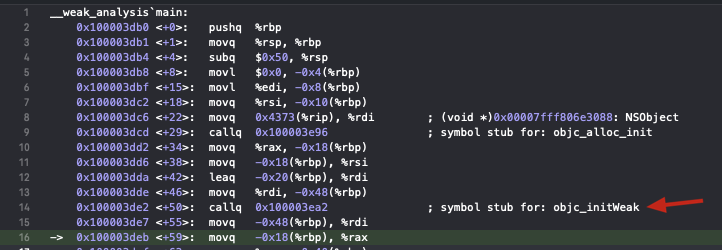

# <center> `__weak`原理

### 目录


### 一、`__weak` 初探

```
NSObject *o = [[NSObject alloc] init];

__weak id weakPtr = o;  

NSLog(@"o=%@、weakPtr=%@", o, weakPtr);   // obj与p指向同一个对象
NSLog(@"o=%p、weakPtr=%p", &o, &weakPtr); // obj指针变量 与 p是不同的。意味着，对象o，被两个指针变量引用。
```

输出结果：
```shell
2021-11-10 16:34:19.651342+0800 __weak_analysis[37648:301251] o=<NSObject: 0x10300b090>、weakPtr=<NSObject: 0x10300b090>
2021-11-10 16:34:19.652486+0800 __weak_analysis[37648:301251] o=0x7ffeefbff418、weakPtr=0x7ffeefbff410
```

打开 `Xcode` 汇编调试，我们可以发现 `__weak id weakPtr = o;` 底层调用了 `objc_initWeak` 函数。




下面我们来看一下 `objc_initWeak` 方法是如何实现的。

### 二、分析底层源码实现

##### 1、源码下载
下载地址：[链接](https://opensource.apple.com/tarballs/objc4/)

本文使用的源码版本：`objc4-756.2`

##### 2、